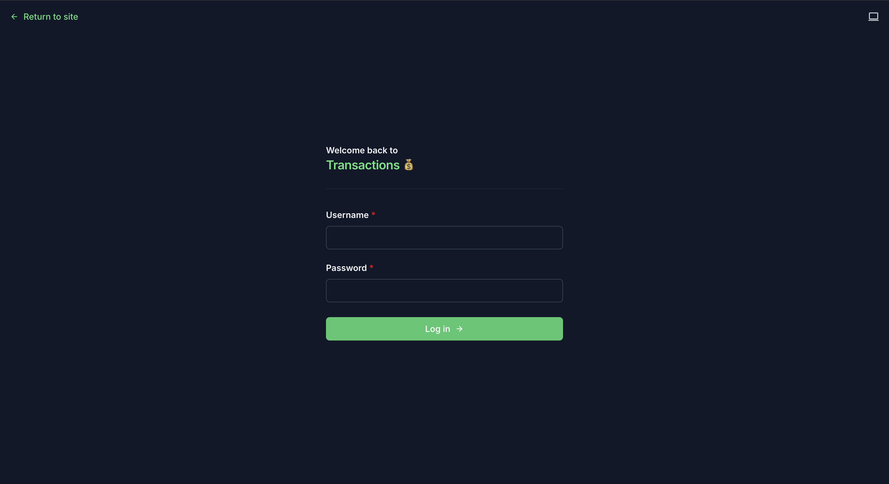
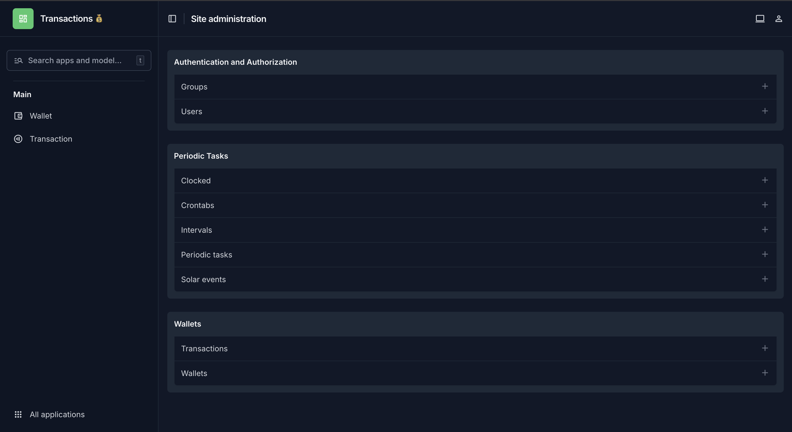

# Transactional System Core ⚡️
## Production-Ready Django Transaction Processing API

A production-ready **Django + DRF + Celery** boilerplate for internal employee wallet transfers and bonus processing.

---

## Features

- ✅ Wallet and Transaction models with full CRUD
- ✅ POST `/api/transfer` endpoint for wallet-to-wallet transfers
- ✅ Atomic transactions with **race condition protection**
- ✅ Automatic commission calculation (>1000 units → 10% commission to admin wallet)
- ✅ Async notifications to recipients via Celery with automatic retries (3 attempts, 3 seconds apart)
- ✅ Dockerized environment (PostgreSQL, Redis)
- ✅ Structured logging
- ✅ Swagger/OpenAPI documentation

---

## Getting Started

### 1. Clone the repository
```bash
git clone git@github.com:ummataliyev/transactional-system-core.git
cd transactional-system-core
```

### 2. Create .env file
Create a .env file for development:
```bash
cp docker/.env-example docker/.env
```

### 3. Check available commands
```bash
make help
```


